# 📊 Paytm Organization Chart Generator Workflow

## 🌟 Executive & CXO Overview (Non-Technical)

### 1. The Core Business Value
Manually designing and updating organizational charts for hundreds of employees is incredibly time-consuming, prone to errors, and highly inconsistent. 

This utility **automates 100% of the design and structural formatting**. By turning any standard employee spreadsheet into a presentation-ready, connected PowerPoint org chart in **less than 3 seconds**, it ensures perfect visual consistency and massive time savings.

---

### 2. How It Works (The 3-Step Zero-Touch Flow)
```
  [1. Input Excel] ────────► [2. One-Click Gen Engine] ────────► [3. Output PPTX]
  Raw Employee List           Dynamic Hierarchy Tracing           Connected Slides
  (e.g., 350+ entries)        & Executive Color Palette           (Ready for boardrooms)
```

---

### 3. Smart Business Rules (Why the Slides Look So Clean)
Instead of creating giant, unreadable "spiderweb" diagrams, the generation engine enforces four key presentation rules:
1. **The 2-Level Rule (Clutter Control):** Each slide focuses strictly on two layers of depth (the leader at the top, and their direct reporting lines).
2. **Dynamic Rollups (The 'DR-' count):** If a direct reportee is a manager, the chart automatically counts their entire team recursively and displays it as a roll-up number (e.g., `DR- 13` or `DR- 5`). It summarizes their department instead of crowding the slide with individual boxes.
3. **Horizontal Grids & Stacks:** If a leader has up to 6 reports, they spread side-by-side. If they have more, the engine automatically wraps them into a balanced multi-row horizontal grid (up to 3 rows) so cards never overlap or overflow.
4. **Corporate Color Grading:** Applies a polished, structured color hierarchy from top-to-bottom:
   - **MD & CEO / Execs:** Dark Navy Blue (Maximum Authority)
   - **SVP / HODs:** Medium Dark Blue
   - **Managers:** Light Blue (with rollup summaries)
   - **Individual Contributors:** Very Light Blue

---

### 4. The Interactive Desktop Application UI
We wrapped this complex math into a clean, modern, single-window desktop application. To generate a slide deck, you only need to:
1. Click **"Browse Excel File"** to select your spreadsheet.
2. Customize the output name (optional).
3. Click **"Generate Organization Chart"**.
4. Receive a success pop-up notification with the ready-to-open PowerPoint file!

---

## 💻 2. System Architecture & Technical Workflow (Mermaid)

```mermaid
graph TD
    %% Define Styles & Classes
    classDef input fill:#fff2cc,stroke:#d6b656,stroke-width:2px,color:#000
    classDef logic fill:#dae8fc,stroke:#6c8ebf,stroke-width:2px,color:#000
    classDef engine fill:#d5e8d4,stroke:#82b366,stroke-width:2px,color:#000
    classDef ui fill:#f8cecc,stroke:#b85450,stroke-width:2px,color:#000
    classDef tools fill:#f5f5f5,stroke:#666666,stroke-width:1px,style:dashed,color:#000

    %% ------------------------------------------------------------------------
    %% Phase 1: Input and Reference Analysis
    %% ------------------------------------------------------------------------
    subgraph P1 [Phase 1: Input & Reference Analysis]
        A[Input Sheet: Gagan's Span .xlsx]:::input -->|Inspection Scripts| B(Analyze Sheets & Columns):::logic
        C[Reference PPTX: Control Functions]:::input -->|python-pptx Geometry Script| D(Reverse-Engineer Layout & Style):::logic
        
        B --> B1[Required Columns: Name, L1 Manager, Designation, Sub Department]:::logic
        D --> D1[Widescreen 16:9 Canvas: 10 x 5.62 inches]:::logic
        D --> D2[Grid & Vertical Stacking Rules]:::logic
        D --> D3[RGB Color Gradient Codes]:::logic
        D --> D4[Connector site mapping: idx 2 Bottom to idx 0 Top]:::logic
    end

    %% ------------------------------------------------------------------------
    %% Phase 2: Algorithm & Layout Engine Development
    %% ------------------------------------------------------------------------
    subgraph P2 [Phase 2: Core Algorithm Development]
        B1 & D1 & D2 & D3 & D4 --> E(Develop Generator Engine: build_org_structure.py):::engine
        
        E --> E1[Rule 1: Direct Reports Tally = DR-X count]:::engine
        E --> E2[Rule 2: Go up to 2 Levels only]:::engine
        E --> E3[Rule 3: Level 2 Managers rolled up with DR Count]:::engine
        E --> E4[Rule 4: Multi-row horizontal grid mapping]:::engine
    end

    %% ------------------------------------------------------------------------
    %% Phase 3: Dataset Generalization & Enhancements
    %% ------------------------------------------------------------------------
    subgraph P3 [Phase 3: Multi-Sheet Generalization]
        F[New Input: LinkedIn Control Functions .xlsx]:::input -->|Execution Run| G(Enhancement & Debug Loop):::engine
        E --> G
        
        G --> G1[Feature 1: Auto-concatenate Leads + Team worksheets]:::engine
        G --> G2[Feature 2: Recursive parent-child traversal for total HC]:::engine
        G --> G3[Feature 3: Dynamic title sub-department mapping]:::engine
        G --> G4[Feature 4: Senior chain auto-trace / VSS on top]:::engine
    end

    %% ------------------------------------------------------------------------
    %% Phase 4: Modern Desktop UI Wrapper
    %% ------------------------------------------------------------------------
    subgraph P4 [Phase 4: Standalone Desktop UI Application]
        G1 & G2 & G3 & G4 --> H[Desktop Wrapper: org_chart_app.py]:::ui
        
        H --> H1[Modern Dark/Light Themes]:::ui
        H --> H2[Drag-and-Drop File Browser dialog]:::ui
        H --> H3[Auto-populated Output Naming]:::ui
        H --> H4[Secondary Thread Execution - prevent GUI freeze]:::ui
        H --> H5[Pulsing Progress Bar & Native MessageBoxes]:::ui
    end

    %% ------------------------------------------------------------------------
    %% Technologies, Libraries, and Tools
    %% ------------------------------------------------------------------------
    subgraph Tech [System Stack, Libraries & Tools]
        T1[pandas]:::tools -.->|Data Wrangling & Concatenation| B & G
        T2[openpyxl]:::tools -.->|Excel Reading engine| B & F
        T3[python-pptx]:::tools -.->|Presentation construction & Shape Connections| E & H
        T4[customtkinter]:::tools -.->|Modern styling UI components| H
        T5[darkdetect]:::tools -.->|System Theme Detection| H
        T6[Mermaid]:::tools -.->|Architecture documentation| P1
    end

    %% Flow connections between Subgraphs
    P1 ==>|Learned Logic| P2
    P2 ==>|Core Generator Engine| P3
    P3 ==>|Polished Engine Code| P4
```



---

## 🛠️ 3. Detailed Technical Narrative (For Engineers)

### Phase 1: Input Analysis & Reverse-Engineering
* **The Goal:** Build an automated system that can translate hierarchically nested organization spreadsheets into beautifully proportioned, highly structured slides (one per HOD), connected with lines and styled with executive colors.
* **The Setup:** We started with Gagan's raw Excel file containing a list of 354 employees, and a finished PowerPoint document displaying the organization structure of the 5 Control Functions (Compliance, Infosec, Legal, Risk, and Audit).
* **The Investigation:** Using custom Python inspection scripts with `pandas` and `openpyxl`, we scanned the columns, traced reporting lines, and mapped out data shapes. 
* **The Breakthrough:** By programmatically querying the XML and shape geometry of the reference PowerPoint file, we reverse-engineered:
  1. Standard **16:9 widescreen dimensions** (10 x 5.62 inches).
  2. The precise **RGB hex color codes** representing executive hierarchies.
  3. The mathematical **horizontal placement formulas** and spacing margins.
  4. The **connector site index ports** (`idx=2` bottom for managers and `idx=0` top for reportees) that allow native elbow lines to auto-route perfectly without overlapping boxes.

### Phase 2: Designing the Core Org-Tree Engine
We codified these learned guidelines into a generic, standalone generator module `build_org_structure.py`. The engine enforces the following business rules:
* **The 2-Level Limit:** To keep slides clutter-free and easy to digest, each slide is strictly capped at 2 levels (Level 1: HOD, Level 2: HOD's direct reports).
* **Headcount Summary Rollup:** If a Level 2 reportee is a manager themselves (i.e. has people reporting to them), instead of drawing dozens of individual boxes below them (which would exceed slide boundaries), we roll up their entire direct and indirect headcount and display it on their card (e.g., `Manager Name \n Designation \n DR- 13`).
* **Visual Grid Wrapping:** If an HOD has more than 6 direct reports, they cannot fit on a single horizontal row. The algorithm automatically maps and divides them into a balanced multi-row grid (up to 3 rows).

### Phase 3: Generalizing for Different Datasets (Multi-Sheet Handling)
When running our generator on the newly introduced LinkedIn Control Functions Excel sheet, we hit and successfully resolved two major logical edge cases:
* **Sheet Concatenation:** Unlike Gagan's single-sheet workbook, the Control Functions Excel is split into `Team` and `Leads`. The upgraded script automatically identifies **all worksheets containing employee columns and concatenates them** on the fly, creating a complete database of all 87 personnel.
* **Recursive Headcount Mapping:** Rather than relying on rigid columns that might not exist in every file, the engine recursively climbs the parent-child `L1 Manager Name` chain from the ground up, guaranteeing 100% headcount accuracy for any manager across any dataset.
* **Smart Senior Tracing:** The generator identifies Gagan's upper managers (Deependra and VSS), but automatically detects when a leader reports directly to Vijay Shekhar Sharma (like the 5 Control Function heads) and adapts the senior hierarchy cards on the fly.

### Phase 4: The Final Modern Desktop UI Application
To make the tool accessible to anyone (even without command-line experience), we wrapped our generator engine into a beautifully polished standalone Desktop GUI (`org_chart_app.py`) built on **`customtkinter`**:
* **Modern Aesthetic:** Supports system-native dark/light themes, rounded entry boxes, and elegant hover animations.
* **File Browsing:** Smooth native browse dialogs for Excel input.
* **Responsiveness (Threading):** Because org-chart mapping can be CPU-intensive, the generation executes on a background thread, keeping the GUI alive and allowing a pulsing progress bar and success message alerts to guide you in real time.
* **Universal Portability:** Includes a **`requirements.txt`** file, making it completely plug-and-play for your Windows testing environment!
